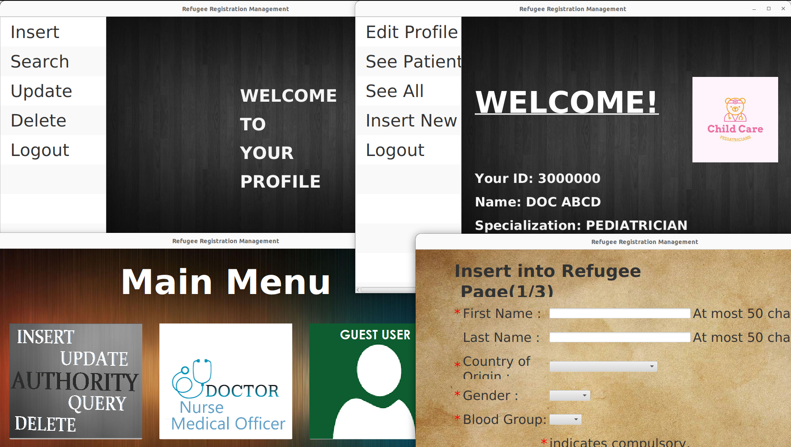

# Refugee Registration Database Management

About: Oracle database, Oracle JDBC, and JavaFX GUI refugee registration management system

This is a database project for CSE 216: Database Sessional. This project implements a simple refugee registration system using Oracle Database 11g, the Oracle JDBC driver, and JavaFX GUI. At the core of this project are Oracle SQL commands that demonstrate insert, query, update, and delete operations in a database.



First of all, we created the database schema in Oracle 11g. There are 12 tables:
1. REFUGEE
1. LOCATION
1. INSTITUTE
1. DOCTOR_NURSE_OFFICER
1. VOLUNTEER
1. EDUCATIONAL_OCCUPATIONAL_INFO
1. PRESCRIPTION
1. DIAGNOSIS
1. COMPLAINT
1. PASS
1. INSCOUNT
1. LOCATIONCOUNT

Then, we apply 3 database triggers, 8 procedures, and 2 functions.

Finally, we build the Java application with oracle JDBC driver for connection to the database and JavaFX for GUI.

For more details on the project, please refer to the [user manual](manual.pdf).

## Requirements

* Database: Oracle 11g
* Java
* JavaFX
* Oracle JDBC driver (version 6 or 7)

## Setup
* From oracle 11g sqlplus run [setup.sql](SQLs/setup.sql):
```
@/path/to/sql/files/setup.sql
```
Also, update path of other sql files in lines 4-7 before running.
* Java:
    1. Add ojdbc jar path to java classpath.
    1. From the folder [java](java), run:
```
export PATH_TO_FX=/path/to/javafx/lib
javac --module-path $PATH_TO_FX --add-modules javafx.controls -d . src/*.java
```
Or (if JavaFX path is set):
```
javac -d . src/*.java
```

## Usage
From [java](java) directory, run:
```
java --module-path $PATH_TO_FX --add-modules javafx.controls refugee_reg_db_mg.Main jdbc:oracle:thin:@172.17.0.2:1521:xe user_refDbMg pass_refDbMg
```
Or:
```
refugee_reg_db_mg.Main jdbc:oracle:thin:@172.17.0.2:1521:xe user_refDbMg pass_refDbMg
```

Here, the three arguments are: the Oracle jdbc driver connection url, the relevant user in the database, and the password of that user, respectively.

## Docker setup
The oracle database can be setup in docker.\
Get oracle 11g and start container:
```
sudo docker pull wnameless/oracle-xe-11g-r2
sudo docker run -p 49161:1521 -e ORACLE_ALLOW_REMOTE=true --name oracle11g wnameless/oracle-xe-11g-r2
```
This runs a docker container named oracle11g with:
```
hostname: localhost
host-port: 49161
container-port: 1521
sid: xe
username: system
password: oracle
```
Later on, to start the container, only run:
```
sudo docker start oracle11g
```
Move the sql files in [SQLs](SQLs) to the container:
```
sudo docker exec -it oracle11g mkdir home/sql
sudo docker cp /path/to/sql/files/. oracle11g:/home/sql
```
Create database user, and schema:
```
sudo docker exec -it oracle11g /bin/bash

su - oracle

sqlplus / as sysdba

@/home/sql/setup.sql
```

To get the IP address for Oracle jdbc connection url:
```
sudo docker inspect -f '{{range.NetworkSettings.Networks}}{{.IPAddress}}{{end}}' oracle11g
```